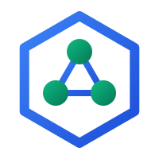
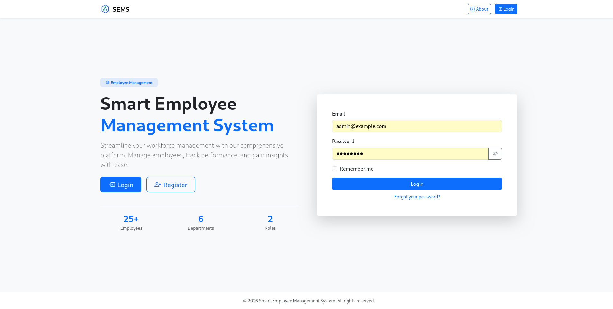
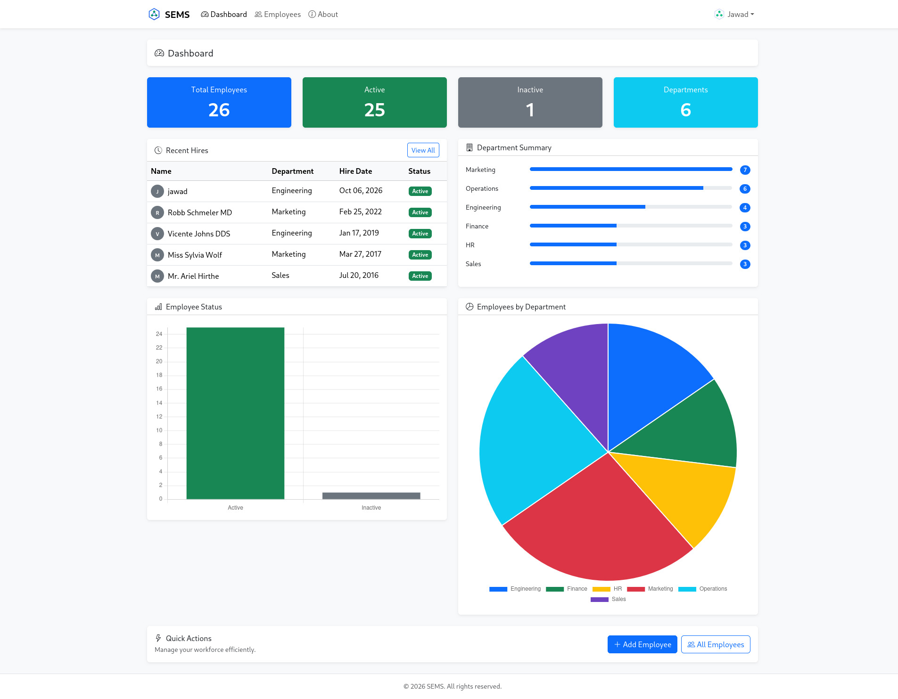
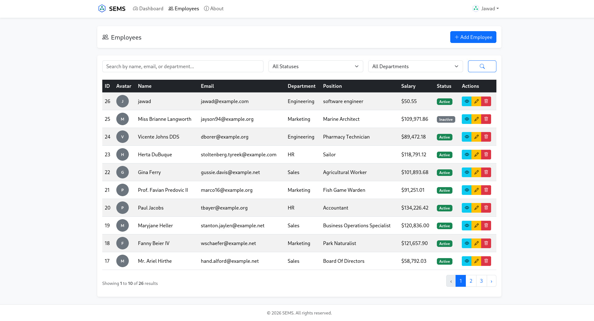
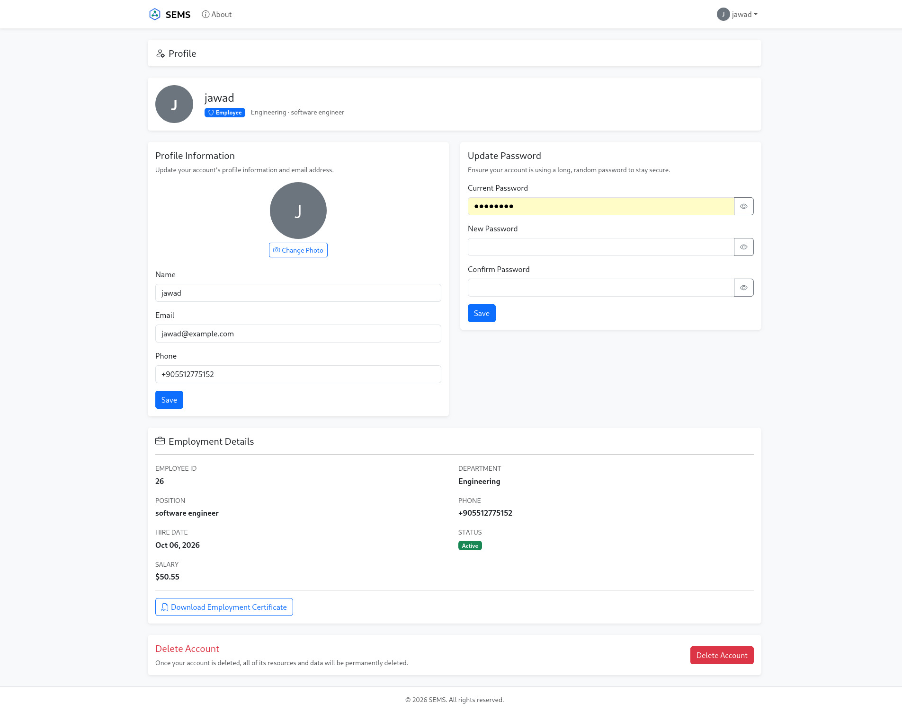
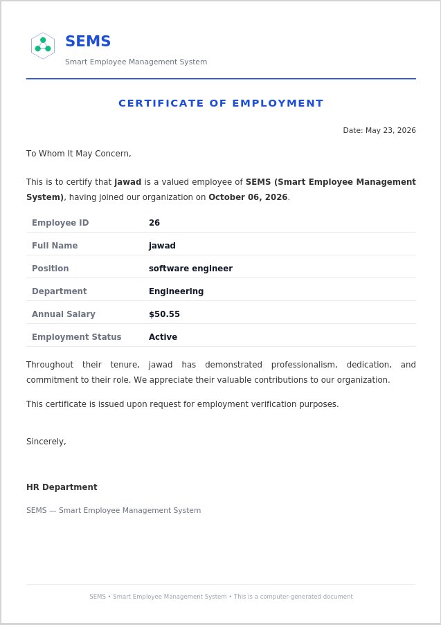
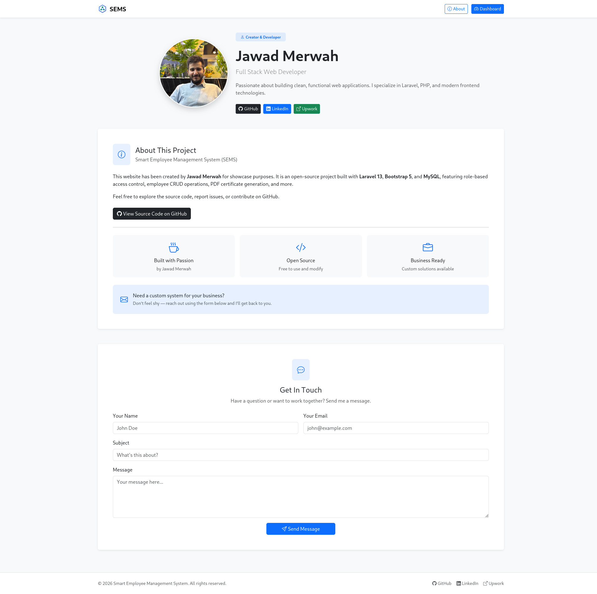

<p align="center">
  
</p>

<h1 align="center">Smart Employee Management System (SEMS)</h1>

<p align="center">
  A Laravel-based admin dashboard for managing employees with role-based access control, PDF certificate generation, and more.
</p>

---

## Features

- **Role-based Authentication** — Admin and Employee roles with separate dashboards
- **Employee CRUD** — Full create, read, update, delete with search and filtering by department/status
- **Admin Dashboard** — Stats overview, recent hires, department summaries, Chart.js charts
- **Employee Profile** — Identity card, employment details, phone/avatar editing
- **PDF Certificate** — Download employment certificate with company logo and salary details
- **Welcome Email** — New employees receive credentials via Resend
- **Password Reset** — Forgot password flow with email reset link
- **Contact Form** — Public about page with email notification
- **Responsive UI** — Bootstrap 5, mobile-friendly

## Screenshots

| Welcome Page | Admin Dashboard |
|:---:|:---:|
|  |  |

| Employee Management | Employee Profile |
|:---:|:---:|
|  |  |

| PDF Certificate | About & Contact |
|:---:|:---:|
|  |  |

## Tech Stack

| Technology | Purpose |
|------------|---------|
| **Laravel 13** | PHP Framework |
| **PHP 8.4** | Backend Language |
| **MySQL** | Database |
| **Bootstrap 5** | Frontend UI |
| **JavaScript (Chart.js)** | Dashboard Charts |
| **Resend API** | Email Service |
| **Dompdf** | PDF Generation |

## Installation

```bash
# Clone the repository
git clone https://github.com/Jawad-02/employee-management-system.git
cd employee-management-system

# Install PHP dependencies
composer install

# Install JavaScript dependencies
npm install

# Environment setup
cp .env.example .env
php artisan key:generate

# Configure your database in .env
# DB_DATABASE=employee_management_system
# DB_USERNAME=root
# DB_PASSWORD=

# Configure mail in .env (Resend)
# MAIL_MAILER=resend
# RESEND_API_KEY=your_resend_api_key

# Run migrations and seeders
php artisan migrate --seed

# Build frontend assets
npm run build

# Create storage link
php artisan storage:link

# Start the server
php artisan serve
```

## Demo Credentials

| Role | Email | Password |
|------|-------|----------|
| **Admin** | `admin@demo.com` | `password` |
| **Employee** | `employee@demo.com` | `password` |

## License

Open source project created by [Jawad Merwah](https://github.com/Jawad-02) for showcase purposes.
